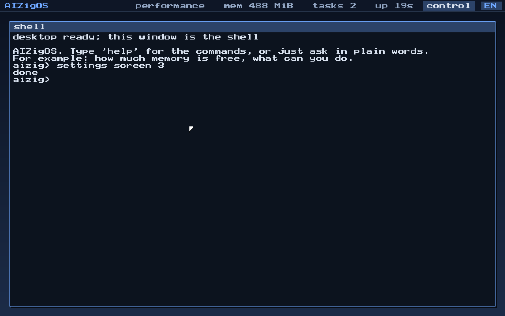
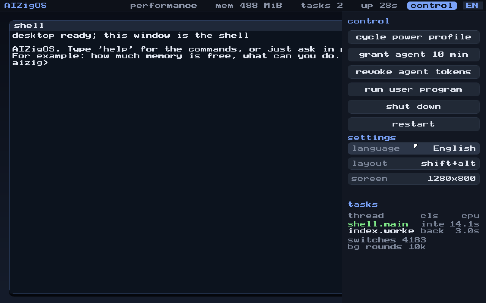
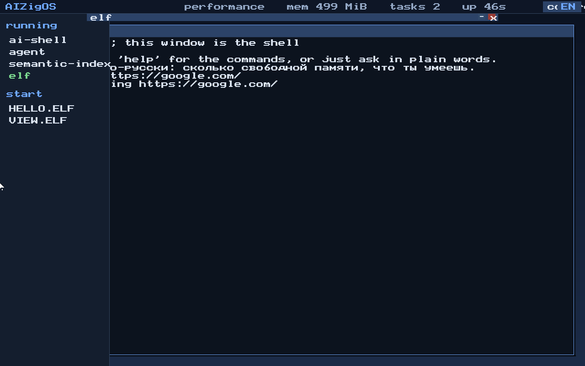
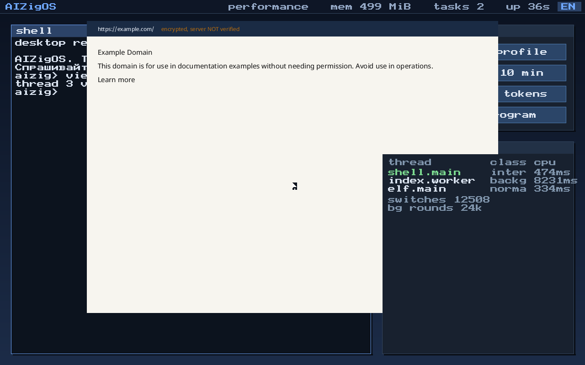
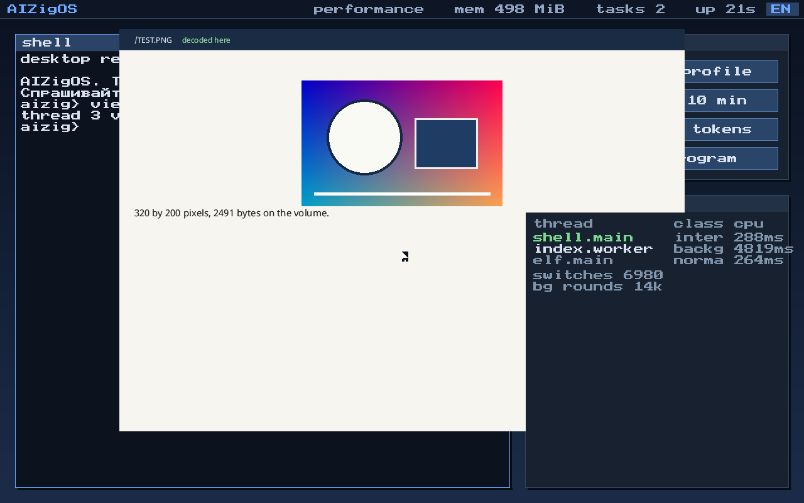

# AIZigOS

A microkernel OS in pure Zig with capability-based security, a semantic
filesystem and an AI shell instead of a classic desktop.

Current state: the kernel (spec section 4.1), the capability subsystem
(section 4.2), preemptive threads, a system call boundary that checks
capabilities, unprivileged user programs, and an interactive shell that boots
on real firmware and draws itself on the framebuffer. The filesystem,
personality servers and the browser UI runtime are later stages — see [docs/ROADMAP.md](docs/ROADMAP.md).


The same machine, before `gui`:


## What works today

| Requirement | State |
|---|---|
| FR-1.1 priority scheduler with power profiles | implemented, preempting real threads |
| FR-1.2 address space isolation | implemented; user programs run unprivileged |
| FR-1.3 sync/async IPC with capability checks | implemented, 8 tests |
| FR-1.4 HAL with a verified contract | implemented, three targets |
| FR-1.5 kernel size budget | `zig build size-audit`, 222–265 KiB against a 384 KiB budget |
| FR-2.1 access only through a token | implemented, enforced at the system call boundary |
| FR-2.2 tokens limited by lifetime and scope | implemented, exposed in the shell |
| FR-2.3 audit log of grants, uses and revocations | implemented, readable from the shell |

Verified by booting, not only by tests:

* **aarch64** (QEMU virt) boots from `-kernel`, enables its own MMU, takes timer
  interrupts and runs the shell over the PL011 UART.
* **x86_64 UEFI** boots from a GPT/FAT32 disk image through OVMF, takes the
  machine from the firmware with ExitBootServices, keeps the GOP framebuffer and
  renders the shell there with its own font; input comes from a PS/2 keyboard or
  the serial line.

95 unit and integration tests run on the host without an emulator.

## Building and running

Requires Zig 0.16.0. QEMU is optional but makes the loop fast.

```sh
zig build test                                    # kernel tests on the host HAL
zig build image --release=small                   # bootable UEFI image (default board)
zig build run --release=small                     # boot it under QEMU + OVMF
zig build size-audit --release=small              # FR-1.5 budget audit

zig build run -Dboard=virt_aarch64 --release=small   # AArch64 in QEMU, serial console
zig build -Dboard=pc_x86_64 --release=small          # legacy Multiboot2 build
```

`zig build image` produces `zig-out/bin/aizigos.img`: a GPT disk with one FAT32
EFI System Partition holding `/EFI/BOOT/BOOTX64.EFI`. The image builder is part
of this repository ([tools/mkimage.zig](tools/mkimage.zig)) — no GRUB, xorriso or
mtools needed.

Options: `-Dkernel-budget=262144`, `-Dimage-size=64`, `-Dovmf=<path to firmware>`.

### In QEMU

```sh
qemu-system-x86_64 -m 512M -drive format=raw,file=zig-out/bin/aizigos.img \
  -drive if=pflash,format=raw,unit=0,readonly=on,file=<qemu>/share/edk2-x86_64-code.fd \
  -drive if=pflash,format=raw,unit=1,file=<writable copy of edk2-i386-vars.fd>
```

### In VirtualBox

```sh
VBoxManage convertfromraw zig-out/bin/aizigos.img aizigos.vdi --format VDI
```

Then create a VM (type "Other/Unknown 64-bit"), tick **Enable EFI** in
System → Motherboard, attach `aizigos.vdi` to the SATA controller and boot.
The shell appears on the VM screen; add a serial port if you want a log on the
host as well.

## The shell

```
aizig> caps
 id  holder  rights      state    ttl(s)  scope / purpose
 1   1      rwlcdgR  active  0   / / filesystem root
 2   1      rwlcgR  active  0   /home/user / user home directory
 3   1      rwgR  active  0   any / devices
 4   2      rl  active  299   /home/user/Documents / shell grant to agent
```

`help`, `ver`, `mem`, `ps`, `power`, `caps`, `grant`, `revoke`, `audit`, `sys`,
`user`, `net`, `ping`, `gui`, `disk`, `ls`, `cat`, `libc`, `lang`, `clear`.
Everything it prints is live kernel state: `grant 10` really derives a token for
the agent process, `revoke` really cascades through the derivation tree,
`power critical` really stops the background thread from being scheduled, and
`sys` really traps into the kernel:

```
aizig> sys
  write() reached the console through a trap
task_id  -> 1
time_ns  -> 4194 ms
audit    -> 3 records
write    -> 45 bytes
fs_access /home/user/Documents/report.md -> allow
fs_access /etc/shadow -> out_of_scope
```

`user` drops a program to ring 3 (EL0 on AArch64), where it can only reach the
kernel through the system call gate:

```
aizig> user
thread 3 is dropping to user mode; watch the log
  a user program is running
[info] thread 3 reports 0x23, privileged: no

aizig> user fault
  reaching for kernel memory now
[err ] user thread 4 (agent.bad) killed: page_fault at 0x1000 (esr=0x7)
```

The second one writes to kernel memory on purpose. The hardware faults, the
kernel kills that thread, and the shell keeps answering.

`gui` hands the framebuffer to a pointer-driven surface: a cursor that follows
a PS/2 mouse, a window, and buttons that switch the power profile, grant the
agent a token, revoke it or start a user program. Escape returns to the shell.
It is a small thing built on what the kernel already owns, not the browser
runtime the specification asks for — that is a later stage.

`ping` goes out over a real network stack — PCI, an e1000 driver, Ethernet,
ARP, IPv4, ICMP — and only after a capability says the host and port are
allowed:

```
aizig> ping 10.0.2.2
pinging 10.0.2.2 ...
reply from 10.0.2.2 in 13470 us

aizig> net
mac      52:54:0:12:34:56
address  10.0.2.15, gateway 10.0.2.2
frames   2 in, 2 out, 0 dropped
icmp     1 sent, 1 answered
```

`ls` and `cat` read the disk the machine booted from. Underneath them are an
ATA driver in the HAL and a read-only FAT32 driver above it, and between them
and the shell is the same capability check as everything else: the token is
issued for `/` with read and list only, and every listing and every read lands
in the audit log.

```
aizig> disk
drive: QEMU HARDDISK
size : 131072 sectors, 64 MiB
volume: FAT32 at LBA 2048
       126975 clusters of 512 bytes, root at cluster 2

aizig> ls /EFI/BOOT
  ..                  <dir>
  BOOTX64.EFI        691200 bytes
2 item(s), 1 file(s), 691200 bytes

aizig> cat /README.TXT
AIZigOS lives on this volume.
...

aizig> audit 2
 #8 used/allow cap 5 holder 1 at 16381 ms  boot volume, read only
 #9 used/allow cap 5 holder 1 at 19682 ms  boot volume, read only
```

The file it prints is the file `zig build image` put there, and the loader it
lists is the kernel doing the listing. The driver reads only: FR-3.1 wants
copy-on-write and live snapshots, which FAT32 cannot do and should not be asked
to. What this is for is the boot medium — the loader, a configuration file, and
in time the model weights.

A program can be told what to do. `exec /HELLO.ELF one two` starts a static
ELF64 off the volume in its own address space and hands it the command line;
the kernel keeps that line and gives it over on request, rather than writing an
argv onto a stack before the program runs. Same information, simpler contract:
nothing about the stack layout is load-bearing, and a program that never asks
pays nothing.

```
aizig> exec /HELLO.ELF one two
hello from /HELLO.ELF
argc 3
  argv[0] = program
  argv[1] = one
  argv[2] = two
```

`view <url>` points the viewer at a page, over `http://` or `https://`. It is a
user-mode program: it takes the address as an argument, opens a socket through
a capability, does TLS and HTTP for itself and paints the text into a surface
the shell gives it. The kernel provides the socket, the token in front of it,
random bytes and the date; the handshake, the certificates and the text format
all live on the far side of the gate, which is where a microkernel with a size
budget wants them.

TLS is Zig's own `std.crypto.tls` client, compiled for a freestanding target
unchanged — no allocator, no operating system, only bytes in and bytes out.
Two things it cannot work out for itself come from the kernel: entropy, which
is the processor's generator and nothing else (a machine without one is told
that TLS will refuse to run, rather than being handed a key built out of a
stopwatch), and the wall clock, read from the CMOS.

**The server is not authenticated yet.** The traffic is encrypted and nothing
checks that the certificate belongs to the host that presented it, because
that needs a certificate store this system does not have. The viewer says so on
the page, in amber, on every https connection. Encryption without
authentication stops someone reading the traffic and does not stop someone
answering in the server's place, and that difference belongs on the screen
rather than in a footnote. "открой
example.com" does the same thing from a sentence. There is no TLS yet, so it
says so rather than failing later and less clearly.

Everything on screen goes through a compositor: three layers — the desktop the
shell paints, a program's window whose pixels the kernel keeps, and the panels
— plus the pointer, composited from a list of damaged rectangles and copied out
once. Before it, every part of the system drew straight into the framebuffer in
whatever order the code happened to run, which works for one window and stops
working the moment there are two. A panel sliding over a program used to erase
it, because nobody had kept its pixels.

The interface speaks one language at a time. It used to speak both at once —
an English greeting with a Russian line under it, English headings, answers in
whichever language the question happened to be in — which is fine for a
demonstration and wrong for a system. There is a setting now, a table with a
column per language, and a compiler that names any string missing from one of
them. The agent is the exception: a Russian question still gets a Russian
answer, because doing otherwise would be a different kind of rudeness.

The disk takes writes now, so settings live in a file like they do everywhere
else: `/AIZIGOS.CFG`, in text, readable with `cat` and fixable by hand from
another machine when this one will not start far enough to fix them from
inside. It records the screen as a size rather than a firmware mode number,
because mode numbers are an index into a list the firmware builds and a
firmware update can renumber them.

The screen size used to need a restart, and the reason was honest: changing a
display mode is the firmware's code, and this kernel takes the firmware's
memory for its own the moment it leaves. There is no calling back into it.

So the kernel drives the display itself. virtio-gpu takes a rectangle of pixels
out of our own memory and shows it; asking for a different size means making a
new one and pointing the screen at it. A few messages, no reboot. The
compositor's layers are rebuilt at the new size, the window is laid out again,
and the choice goes into the settings file so the machine comes back the same
way.

On a machine with no such device nothing is lost: the framebuffer the firmware
handed over carries on exactly as before, the sizes it offered are still
listed, and a choice among them still waits for the next start. The panel and
`settings` say which of the two this machine is by what they answer — "done",
or "it applies at the next start".





The panel can stop the machine and restart it. That needed ACPI, and not much
of it: the firmware's tables say where the power registers are, and the one
value that lives in bytecode -- the sleep type for state five -- sits in a
shape small enough to find by name without an interpreter. If a machine needs
more than that to shut down, the panel says it cannot rather than writing
something hopeful to a register.

Buttons belong to the panel layer. They used to inherit whichever layer the
caller happened to be painting into, which was right while the panel was being
painted and wrong on every hover: moving the pointer over a button stamped all
of them into the desktop layer, underneath the panel where nobody could see
them, and they stayed there when the panel slid away. That was the debris on
screen after closing it.

The desktop is one window and two panels. The launcher slides out when the
pointer reaches the left edge: what is running, and what can be started from
the volume. Control and tasks slide out from the right on the tab in the
status bar. A program that holds a surface gets a title bar with the two
buttons every window system has — put away, and close — and can be dragged by
it; Escape always comes back to the shell, because a wedged program must not be
able to keep the keyboard.






Pages are laid out rather than stripped: a tag stack, the default stylesheet
every browser has believed since 1996, the page's own `<style>` and `style=`
for colour, size, weight, alignment, background and `display: none`, block
boxes down the page with margins, and inline text wrapped at the font's own
measurements. Headings come out as headings, links are blue and underlined and
can be followed, backspace goes back. Four faces sit on the volume — upright,
bold, italic and fixed-width — so `<b>` and `<code>` mean something.

What it is not is an engine: no floats, no positioning, no cascade with
specificity, selectors only by tag, class and id. That is what NetSurf is for,
and this file's job is to prove the fetch, the font, the plotter and the
surface while they are still cheap to change.

The text is a TrueType face read off the volume and rasterised here — cmap,
outlines, coverage — because a system that wrote its own filesystem and its own
TLS should not have its letters arrive as a black box. The face itself is not
in this repository: it is someone else's work under someone else's licence, and
`zig build image` takes it from the machine doing the building
(`-Dfont=<path>`, Noto by default).

`view /TEST.PNG` reads a file off the boot volume and decodes it: inflate and
the PNG filters are in [user/image.zig](user/image.zig), and the picture is
scaled and blended by the plotter.



## Talking to it

Anything that is not a command is treated as a sentence, in Russian or English:

```
aizig> how much memory is free
free memory: 375 MiB

aizig> выдай агенту доступ на 7 минут
выдан токен: 5
он живёт 7 минут

aizig> напиши стихотворение
Не понял. Пока это таблица фраз, а не модель.
```

That last answer is the honest one: this is a phrase table in
[kernel/agent.zig](kernel/agent.zig), not a model. It is shaped so that Ascora
Nano R1 can replace the recogniser without touching anything else — the model
turns a sentence into an intent, and the kernel keeps doing the capability
check, the work and the audit record. See [docs/ASCORA.md](docs/ASCORA.md) for
what still stands between here and there.

For the browser the specification asks for in FR-5.1, the same kind of honest
account is in [docs/BROWSER.md](docs/BROWSER.md): what has to exist first, in
what order, and why the browser cannot live inside the kernel.

## Layout

```
kernel/
  hal/            HAL: the contract plus implementations
    contract.zig  the formal contract, verified at compile time
    aarch64/      PL011, generic timer, GICv2, MMU, exception vectors
    x86_64/       COM1, PIT/TSC, IDT+PIC, PS/2, page tables, Multiboot2
    uefi_x86_64/  firmware handover, GOP framebuffer console, 8x8 font
    x86_64/       ... plus PS/2 keyboard and mouse, GDT and TSS
    host/         software implementation used by the tests
  mm/             pmm.zig (frames), vmm.zig (address spaces)
  cap/            cap.zig (tokens, attenuation, revocation), audit.zig (log)
  sched/          sched.zig (64 priorities, 4 classes), power.zig (profiles)
  ipc/            endpoints, sync/async, token delegation
  proc/           processes: address space + token ownership + threads
  shell.zig       the interactive shell
  syscall.zig     the system call boundary
  user.zig        the first user-mode programs
  gui.zig         the pointer-driven surface
  net/            Ethernet, ARP, IPv4, ICMP — no I/O, all testable
  fs/fat32.zig    read-only FAT32 and just enough GPT to find the partition
  agent.zig       sentences in two languages mapped onto kernel intents
  mm/heap.zig     the kernel heap, for the C code and model weights to come
  main.zig        kernel assembly and initialisation
lib/
  libc/           the C library: string, ctype, stdlib, stdio
  fatimage.zig    the image layout, shared by the builder and the tests
tools/
  mkimage.zig     GPT + FAT32 bootable image builder
  size_audit.zig  the size budget audit (FR-1.5), ELF and PE
```

Documentation: [architecture](docs/ARCHITECTURE.md), [roadmap](docs/ROADMAP.md).
