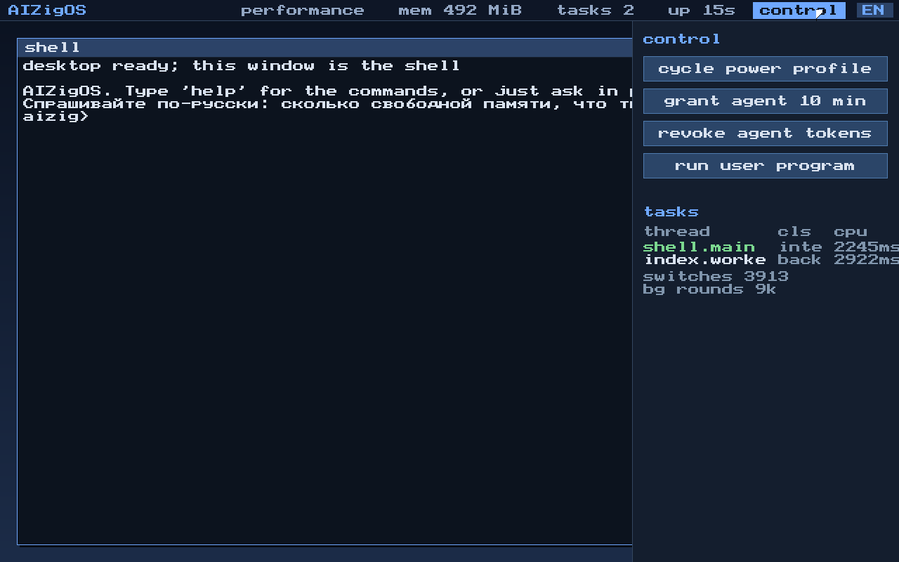
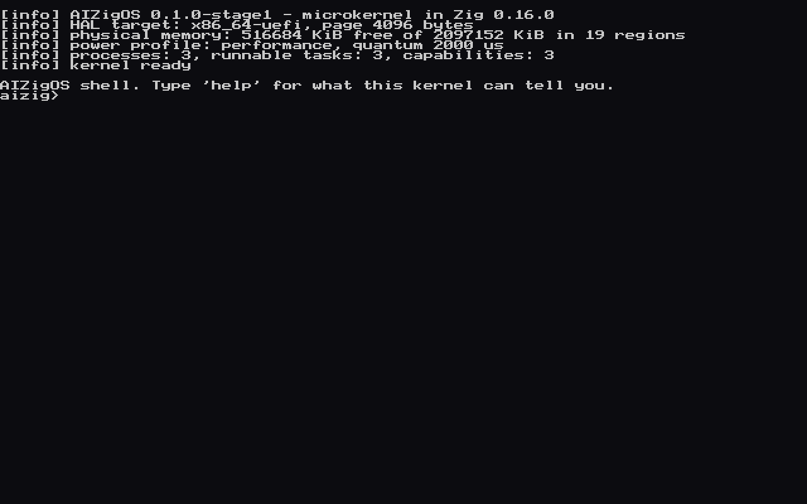

# AIZigOS

A microkernel OS in pure Zig with capability-based security, a semantic
filesystem and an AI shell instead of a classic desktop.

Current state: the kernel (spec section 4.1), the capability subsystem
(section 4.2), preemptive threads, a system call boundary that checks
capabilities, unprivileged user programs, and an interactive shell that boots
on real firmware and draws itself on the framebuffer. The filesystem,
personality servers and the browser UI runtime are later stages — see [docs/ROADMAP.md](docs/ROADMAP.md).



The same machine, before `gui`:



## What works today

| Requirement | State |
|---|---|
| FR-1.1 priority scheduler with power profiles | implemented, preempting real threads |
| FR-1.2 address space isolation | implemented; user programs run unprivileged |
| FR-1.3 sync/async IPC with capability checks | implemented, 8 tests |
| FR-1.4 HAL with a verified contract | implemented, three targets |
| FR-1.5 kernel size budget | `zig build size-audit`, 222–265 KiB against a 384 KiB budget |
| FR-2.1 access only through a token | implemented, enforced at the system call boundary |
| FR-2.2 tokens limited by lifetime and scope | implemented, exposed in the shell |
| FR-2.3 audit log of grants, uses and revocations | implemented, readable from the shell |

Verified by booting, not only by tests:

* **aarch64** (QEMU virt) boots from `-kernel`, enables its own MMU, takes timer
  interrupts and runs the shell over the PL011 UART.
* **x86_64 UEFI** boots from a GPT/FAT32 disk image through OVMF, takes the
  machine from the firmware with ExitBootServices, keeps the GOP framebuffer and
  renders the shell there with its own font; input comes from a PS/2 keyboard or
  the serial line.

95 unit and integration tests run on the host without an emulator.

## Building and running

Requires Zig 0.16.0. QEMU is optional but makes the loop fast.

```sh
zig build test                                    # kernel tests on the host HAL
zig build image --release=small                   # bootable UEFI image (default board)
zig build run --release=small                     # boot it under QEMU + OVMF
zig build size-audit --release=small              # FR-1.5 budget audit

zig build run -Dboard=virt_aarch64 --release=small   # AArch64 in QEMU, serial console
zig build -Dboard=pc_x86_64 --release=small          # legacy Multiboot2 build
```

`zig build image` produces `zig-out/bin/aizigos.img`: a GPT disk with one FAT32
EFI System Partition holding `/EFI/BOOT/BOOTX64.EFI`. The image builder is part
of this repository ([tools/mkimage.zig](tools/mkimage.zig)) — no GRUB, xorriso or
mtools needed.

Options: `-Dkernel-budget=262144`, `-Dimage-size=64`, `-Dovmf=<path to firmware>`.

### In QEMU

```sh
qemu-system-x86_64 -m 512M -drive format=raw,file=zig-out/bin/aizigos.img \
  -drive if=pflash,format=raw,unit=0,readonly=on,file=<qemu>/share/edk2-x86_64-code.fd \
  -drive if=pflash,format=raw,unit=1,file=<writable copy of edk2-i386-vars.fd>
```

### In VirtualBox

```sh
VBoxManage convertfromraw zig-out/bin/aizigos.img aizigos.vdi --format VDI
```

Then create a VM (type "Other/Unknown 64-bit"), tick **Enable EFI** in
System → Motherboard, attach `aizigos.vdi` to the SATA controller and boot.
The shell appears on the VM screen; add a serial port if you want a log on the
host as well.

## The shell

```
aizig> caps
 id  holder  rights      state    ttl(s)  scope / purpose
 1   1      rwlcdgR  active  0   / / filesystem root
 2   1      rwlcgR  active  0   /home/user / user home directory
 3   1      rwgR  active  0   any / devices
 4   2      rl  active  299   /home/user/Documents / shell grant to agent
```

`help`, `ver`, `mem`, `ps`, `power`, `caps`, `grant`, `revoke`, `audit`, `sys`,
`user`, `net`, `ping`, `gui`, `disk`, `ls`, `cat`, `libc`, `lang`, `clear`.
Everything it prints is live kernel state: `grant 10` really derives a token for
the agent process, `revoke` really cascades through the derivation tree,
`power critical` really stops the background thread from being scheduled, and
`sys` really traps into the kernel:

```
aizig> sys
  write() reached the console through a trap
task_id  -> 1
time_ns  -> 4194 ms
audit    -> 3 records
write    -> 45 bytes
fs_access /home/user/Documents/report.md -> allow
fs_access /etc/shadow -> out_of_scope
```

`user` drops a program to ring 3 (EL0 on AArch64), where it can only reach the
kernel through the system call gate:

```
aizig> user
thread 3 is dropping to user mode; watch the log
  a user program is running
[info] thread 3 reports 0x23, privileged: no

aizig> user fault
  reaching for kernel memory now
[err ] user thread 4 (agent.bad) killed: page_fault at 0x1000 (esr=0x7)
```

The second one writes to kernel memory on purpose. The hardware faults, the
kernel kills that thread, and the shell keeps answering.

`gui` hands the framebuffer to a pointer-driven surface: a cursor that follows
a PS/2 mouse, a window, and buttons that switch the power profile, grant the
agent a token, revoke it or start a user program. Escape returns to the shell.
It is a small thing built on what the kernel already owns, not the browser
runtime the specification asks for — that is a later stage.

`ping` goes out over a real network stack — PCI, an e1000 driver, Ethernet,
ARP, IPv4, ICMP — and only after a capability says the host and port are
allowed:

```
aizig> ping 10.0.2.2
pinging 10.0.2.2 ...
reply from 10.0.2.2 in 13470 us

aizig> net
mac      52:54:0:12:34:56
address  10.0.2.15, gateway 10.0.2.2
frames   2 in, 2 out, 0 dropped
icmp     1 sent, 1 answered
```

`ls` and `cat` read the disk the machine booted from. Underneath them are an
ATA driver in the HAL and a read-only FAT32 driver above it, and between them
and the shell is the same capability check as everything else: the token is
issued for `/` with read and list only, and every listing and every read lands
in the audit log.

```
aizig> disk
drive: QEMU HARDDISK
size : 131072 sectors, 64 MiB
volume: FAT32 at LBA 2048
       126975 clusters of 512 bytes, root at cluster 2

aizig> ls /EFI/BOOT
  ..                  <dir>
  BOOTX64.EFI        691200 bytes
2 item(s), 1 file(s), 691200 bytes

aizig> cat /README.TXT
AIZigOS lives on this volume.
...

aizig> audit 2
 #8 used/allow cap 5 holder 1 at 16381 ms  boot volume, read only
 #9 used/allow cap 5 holder 1 at 19682 ms  boot volume, read only
```

The file it prints is the file `zig build image` put there, and the loader it
lists is the kernel doing the listing. The driver reads only: FR-3.1 wants
copy-on-write and live snapshots, which FAT32 cannot do and should not be asked
to. What this is for is the boot medium — the loader, a configuration file, and
in time the model weights.

## Talking to it

Anything that is not a command is treated as a sentence, in Russian or English:

```
aizig> how much memory is free
free memory: 375 MiB

aizig> выдай агенту доступ на 7 минут
выдан токен: 5
он живёт 7 минут

aizig> напиши стихотворение
Не понял. Пока это таблица фраз, а не модель.
```

That last answer is the honest one: this is a phrase table in
[kernel/agent.zig](kernel/agent.zig), not a model. It is shaped so that Ascora
Nano R1 can replace the recogniser without touching anything else — the model
turns a sentence into an intent, and the kernel keeps doing the capability
check, the work and the audit record. See [docs/ASCORA.md](docs/ASCORA.md) for
what still stands between here and there.

## Layout

```
kernel/
  hal/            HAL: the contract plus implementations
    contract.zig  the formal contract, verified at compile time
    aarch64/      PL011, generic timer, GICv2, MMU, exception vectors
    x86_64/       COM1, PIT/TSC, IDT+PIC, PS/2, page tables, Multiboot2
    uefi_x86_64/  firmware handover, GOP framebuffer console, 8x8 font
    x86_64/       ... plus PS/2 keyboard and mouse, GDT and TSS
    host/         software implementation used by the tests
  mm/             pmm.zig (frames), vmm.zig (address spaces)
  cap/            cap.zig (tokens, attenuation, revocation), audit.zig (log)
  sched/          sched.zig (64 priorities, 4 classes), power.zig (profiles)
  ipc/            endpoints, sync/async, token delegation
  proc/           processes: address space + token ownership + threads
  shell.zig       the interactive shell
  syscall.zig     the system call boundary
  user.zig        the first user-mode programs
  gui.zig         the pointer-driven surface
  net/            Ethernet, ARP, IPv4, ICMP — no I/O, all testable
  fs/fat32.zig    read-only FAT32 and just enough GPT to find the partition
  agent.zig       sentences in two languages mapped onto kernel intents
  mm/heap.zig     the kernel heap, for the C code and model weights to come
  main.zig        kernel assembly and initialisation
lib/
  libc/           the C library: string, ctype, stdlib, stdio
  fatimage.zig    the image layout, shared by the builder and the tests
tools/
  mkimage.zig     GPT + FAT32 bootable image builder
  size_audit.zig  the size budget audit (FR-1.5), ELF and PE
```

Documentation: [architecture](docs/ARCHITECTURE.md), [roadmap](docs/ROADMAP.md).
